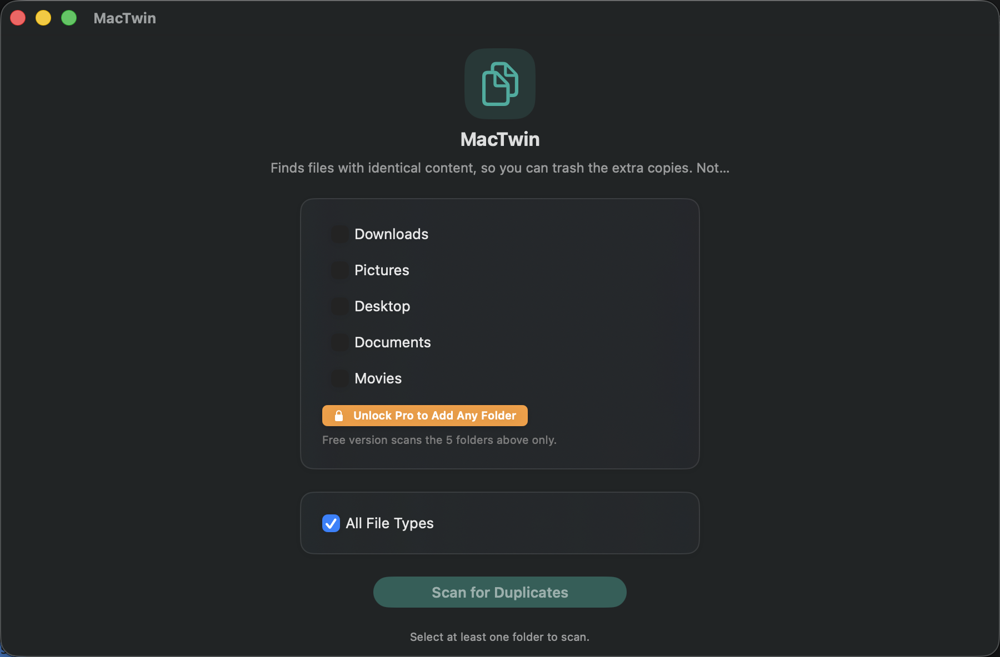
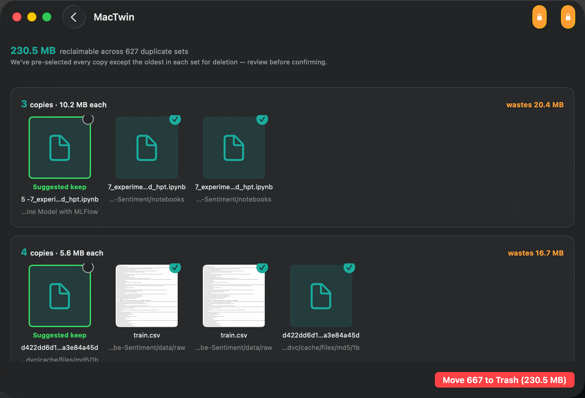
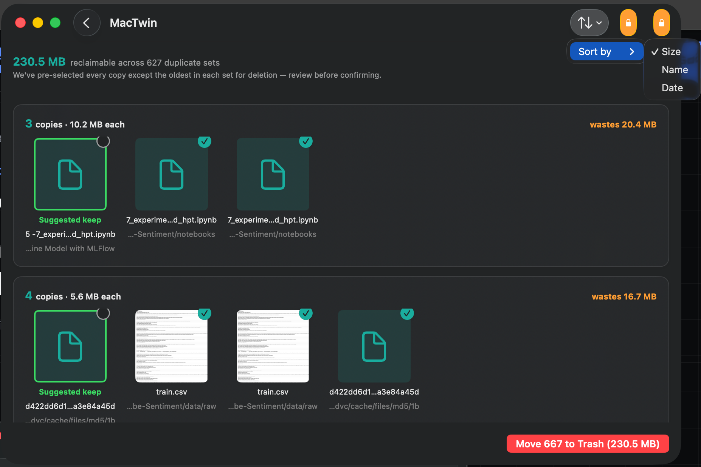
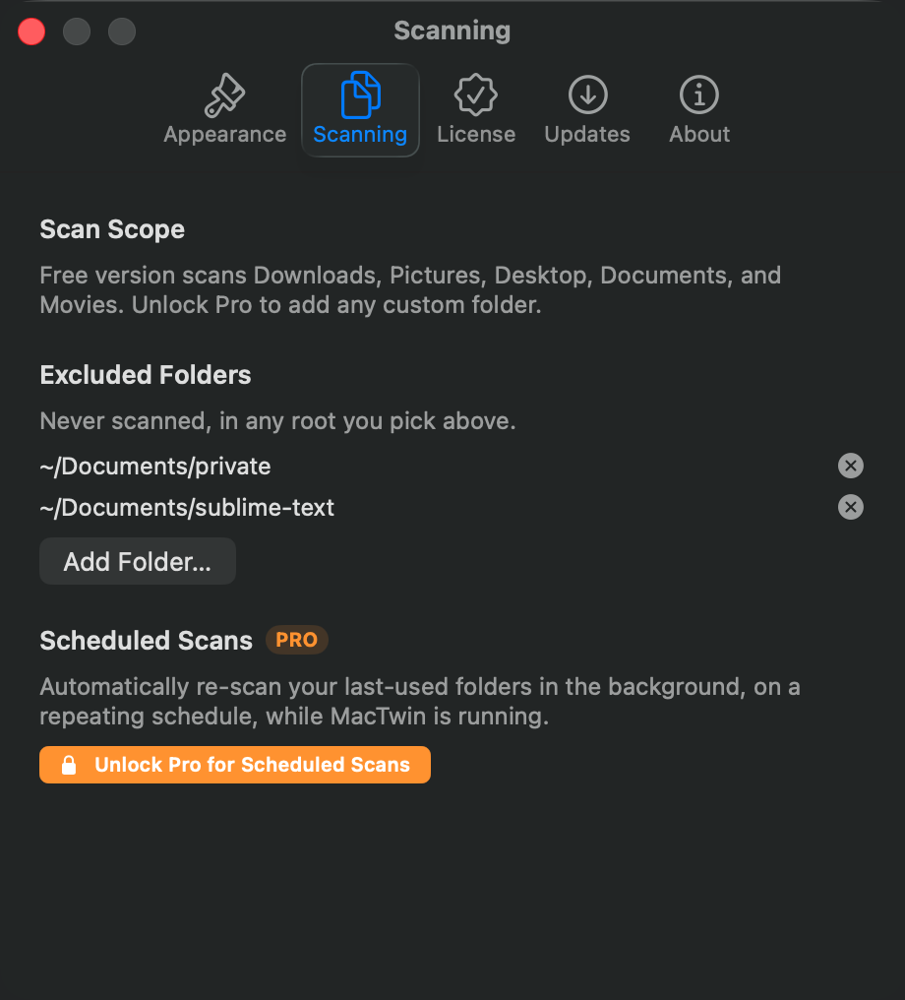

# MacTwin

A native macOS duplicate-file finder. Pure Swift + SwiftUI, no Xcode, zero
third-party dependencies. Offline and private — every scan and hash happens
locally; nothing leaves your Mac.

MacTwin's companion app [DiskSweeper](https://github.com/soodrajesh/mac-cleanup)
(ships as MacGroom) reclaims space from caches and junk; MacTwin reclaims
space differently — same-content files you genuinely meant to keep, just
more than once. MacTwin's UI follows the same MacGroom-level design
system as its siblings (semantic colors, a scalable Text Size setting,
native toolbar chrome) — see `Sources/Support.swift` and
`Sources/Views/SettingsView.swift`.

**v2 UI refresh:** the interface now follows the gogenops mac-apps "modern &
colorful" design system — a dedicated teal `Color.appAccent`, tinted
rounded-square icon tiles instead of bare SF Symbols, card layouts with real
depth (material backgrounds, stroke, shadow), bolder stat typography for
file counts/sizes, and spring animations on scan progress and result
appearance. See `Sources/Support.swift`'s `Color.appAccent` / `IconTile`.

## Screenshots



Results, with a suggested keep highlighted and every other copy pre-checked for Trash — sortable by Size, Name, or Date:

| Results | Sort by |
|---|---|
|  |  |

Excluding a folder — from Settings, or right-click any result — keeps it out of every future scan (MacTwin Pro):



## Free vs. Pro

The core safety-first loop — full scan, review, and manual Trash — is
**free, unlimited, forever**. That's the trust story: nothing about
deciding what to delete or actually deleting it is ever gated.

| | Free | Pro |
|---|---|---|
| Scan, review, manual Trash | ✅ | ✅ |
| Scan scope | Downloads, Pictures, Desktop, Documents, Movies | + any custom folder, unlimited |
| Auto-select strategy | Keep Oldest (default) | + Keep Newest, Keep Shortest Path |
| Export scan report (CSV) | — | ✅ |
| Scheduled background scans | — | ✅ |
| Exclude folders from scans | — | ✅ |

### MacTwin Pro

Pro is a one-time license key, verified against
[Polar.sh](https://polar.sh) — the same verification flow and Keychain-backed,
tamper-evident local cache as MacGroom's own Pro licensing
(`Sources/MacTwinLicenseCheck.swift`, template:
`mac-cleanup/Sources/MacGroomLicenseCheck.swift`), but its own **separate**
Polar product — MacTwin Pro is not part of the MacGroom bundle.

Enter your license key from Settings → License (⌘,). Every Pro-gated
control shows an inline "Unlock Pro" prompt when unlicensed rather than
silently disabling — see `Sources/Views/ProGate.swift`.

**Setup TODO before this is live**: `PolarConfig` in
`Sources/MacTwinLicenseCheck.swift` carries a placeholder organization ID
and purchase URL with the full checklist of what needs creating in the
Polar dashboard.

## Safety model

- **Duplicates go to Trash, never `removeItem`** — recoverable until you
  empty it, matching DiskSweeper's model exactly.
- **You always review before anything moves.** Scanning only selects
  suggested copies to trash (everything but the oldest in each set); nothing
  is trashed until you confirm in the deletion sheet.
- **Content-based, not name-based.** Two files are only ever called
  duplicates if their bytes match exactly (same size, then a full SHA-256)
  — never by filename or "looks similar."

## Build & run

Requires the Xcode Command Line Tools (`xcode-select --install`).

```bash
git clone https://github.com/soodrajesh/mac-twin.git
cd mac-twin
./build.sh
open /Applications/MacTwin.app
```

`build.sh` compiles the sources, renders the app icon from an SF Symbol,
bundles `MacTwin.app`, and installs it to `/Applications`.

## How it works

1. **Pick folders** — quick-select Downloads, Pictures, Desktop, Documents,
   Movies, or choose any custom folder.
2. **Pick file types (optional)** — defaults to "All File Types". Turn that
   off to scan only Images, Videos, Audio, and/or Documents (each a preset
   extension list), plus a free-text box for anything else (`psd, sketch`).
   The filter narrows which files are even considered — it doesn't change
   how duplicates are found, so two files with identical bytes but different
   extensions still correctly group together when no filter is set.
3. **Scan** — recursively walks the chosen folders. Files are first bucketed
   by size (a free `stat`, no content read) to eliminate anything that can't
   possibly have a duplicate; only size-collision survivors get a full
   streamed SHA-256 hash, computed concurrently across your CPU's cores.
4. **Review** — each duplicate set shows a Quick Look thumbnail (images,
   PDFs, videos — anything Quick Look renders) per copy, with the oldest
   copy suggested as the keeper (ties broken by shortest path) and every
   other copy pre-checked for Trash. Paths are truncated to fit the card —
   hover for the full path, or right-click to Copy Path or Reveal in Finder.
   Double-click a thumbnail to reveal it directly.
5. **Confirm** — one sheet shows the count and total size, then moves the
   checked copies to Trash.

## Testing

The grouping algorithm — size/hash bucketing, keeper selection, sort order —
has regression coverage in `Tests/`, run directly against the real logic
files (no XCTest, no Xcode project or SwiftPM package, matching the rest of
this project's `swiftc`-only build):

```bash
Tests/run_tests.sh
```

## Layout

```
Sources/
  App.swift, Models.swift, DuplicateGrouping.swift, FileCategory.swift, Support.swift, DupeModel.swift
  Services/  HashService, DuplicateScanner, TrashService
  Views/     MainView, StartView, ResultsView, GroupRowView, ThumbnailView,
             ConfirmDeletionSheet
```

## License

MIT
